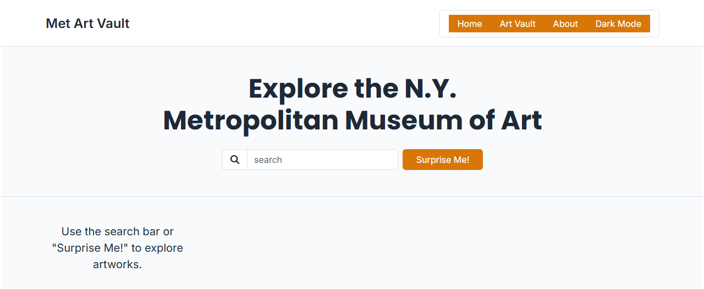
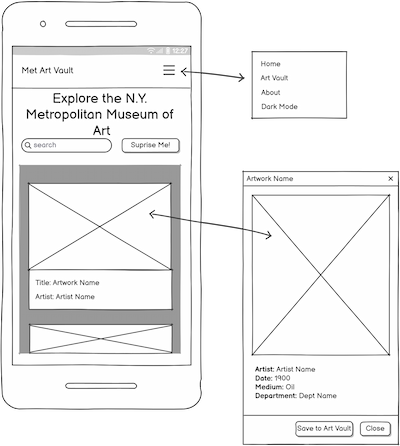
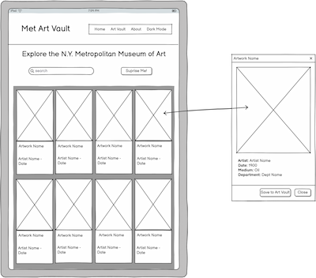
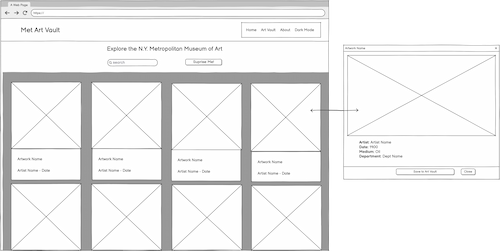

# Met Art Vault

## Introduction

Met Art Vault is an interactive front-end web application that allows users to explore the vast collection of The Metropolitan Museum of Art. This project enables users to search through thousands of public domain artworks, view detailed information, and build a personal collection by saving their favourite pieces to a virtual "Art Vault".
The application demonstrates modern front-end development practices including responsive design, dynamic content rendering, client-side data persistence, and integration with a third-party public API.

**Hero Image** 



**Live Site** https://blitzgeist-69.github.io/ms2-met-artvault/

## Project Description

Met Art Vault is a single-page application (SPA) designed to provide an intuitive and engaging way for art enthusiasts, students, and casual browsers to discover and curate artworks from The Met’s open collection of over 470,000 pieces.

Key Features:

* Search functionality to find artworks by keyword
* Responsive card-based layout displaying search results
* Detailed artwork view through an interactive modal
* Ability to save and manage favourite artworks in a personal "Art Vault" using localStorage
* Dark mode support for improved user experience
* Fullscreen image viewing for closer inspection of artworks
* Fully responsive design optimised for mobile, tablet, and desktop devices

The project was developed using HTML5, CSS3 (with Bootstrap 5), and vanilla JavaScript. It consumes the public Metropolitan Museum of Art Collection API to fetch real-time artwork data. No backend or user authentication is required, as all user data (saved artworks) is stored locally in the browser.
This project showcases core front-end skills including:

* DOM manipulation
* Asynchronous JavaScript (Fetch API)
* Responsive web design
* Client-side state management
* Accessibility considerations
* Clean code structure and documentation

**Live Site:**

https://blitzgeist-69.github.io/ms2-met-artvault/

**GitHub Repo:**

https://github.com/Blitzgeist-69/ms2-met-artvault

## UX Design - The 5 Planes

### 1. Strategy (Project Goals)

The strategy behind Met Art Vault was to create an engaging, user-friendly front-end application that allows people to explore The Metropolitan Museum of Art’s vast public collection in an intuitive way.
The core objective was to build a fully functional single-page application that demonstrates strong front-end development skills while delivering real value to users. The application enables users to search for artworks, view detailed information, and curate a personal collection through a “Art Vault” feature — all without requiring a backend or user accounts.
The project follows a mobile-first approach, ensuring a seamless experience across devices. Emphasis was placed on clean design, accessibility, performance, and clear user feedback. The use of the public Met Museum API allowed for dynamic, real-time content while keeping the project focused on front-end technologies.

Key strategic decisions included:

* Using localStorage for data persistence to avoid the need for user authentication.
* Implementing a modal-based detail view to keep users on a single page.
* Prioritising responsive design and accessibility to meet modern web standards.
* Structuring the codebase in a clean, maintainable way to support future development.

### 2. Scope (Features)

**In Scope**

* Search functionality allowing users to query the Metropolitan Museum of Art public API
* Dynamic display of search results using responsive Bootstrap cards
* Interactive modal displaying detailed artwork information (artist, date, medium, department)
* Ability to save and remove artworks to/from a personal Art Vault using localStorage
* Ability to view Art Vault contents
* Fullscreen image viewing when clicking on an artwork image in the modal
* Dark mode toggle with preference saved in localStorage
* Fully responsive design optimised for mobile, tablet, and desktop devices
* Loading states and error handling during API calls
* “Surprise Me!” button to discover random artworks
* Clean, accessible, and maintainable code structure
* About button gives information about the Met Art Vault website

**Out of Scope**

The following features were considered but deliberately excluded from the current version of the project:

* User authentication or account system (all data is stored locally using localStorage)
* Advanced filtering options (e.g. by department, date range, or artist nationality)
* Social sharing features
* User comments or ratings on artworks
* Integration with additional museum APIs (e.g. Rijksmuseum)

These features were deemed out of scope due to time constraints.

**Known Limitations**

* The application relies entirely on the public Met Museum API. Any changes or downtime on the API side may affect functionality.
* Saved artworks are stored locally in the browser and will be lost if the user clears their browser data or uses a different device/browser.
* Some artworks returned by the API may have missing data (e.g. no image or artist information). The application handles these cases by filtering or displaying fallback content.


### 3. Structure (Information Architecture)

Met Art Vault is built as a Single Page Application (SPA). All content is delivered through a single index.html file, with JavaScript dynamically updating the interface based on user interactions. This approach provides a smooth, app-like experience without requiring page reloads.

| Section          | Description                                                                 | Triggered By                          |
|------------------|-----------------------------------------------------------------------------|---------------------------------------|
| **Navbar**       | Contains the logo, navigation links, search bar, "Surprise Me!" button, and dark mode toggle | Always visible                        |
| **Hero Section** | Introductory headline and tagline                                           | Default view on page load             |
| **Results Area** | Dynamically displays artwork cards after a search or when viewing the Art Vault | Search or clicking "Art Vault"        |
| **Artwork Modal**| Displays detailed information about a selected artwork                      | Clicking on any artwork card          |
| **Art Vault View**| Shows the user's saved artworks (loaded from localStorage)                 | Clicking "Art Vault" in navbar        |

**Navigation**

* The navbar provides primary navigation.
* On desktop and tablet, navigation links (Home, Art Vault, About) are displayed horizontally.
* On mobile, navigation is collapsed behind a hamburger menu.
* Clicking "Art Vault" replaces the search results with the user’s saved artworks.
* Clicking on any artwork card opens a modal with more details.
* The modal can be closed by clicking the close button, clicking outside the modal, or pressing the Esc key.
* The "Surprise Me!" button performs a random search to help users discover new artworks.

**Information Hierarchy**

* Primary focus: Artwork discovery through search and browsing.
* Secondary focus: Personal curation through the Art Vault feature.
* Supporting elements: Clear visual hierarchy, consistent card design, and intuitive modal interactions help users understand the relationship between search results, artwork details, and saved items.

### 4. Skeleton (Wireframes)

The wireframes were created using Balsamiq. **Click for full image.**

The wireframes show:

#### Mobile 

[](assets/wireframes/mobile-met-art-vault-wireframe.png)

#### Tablet

[](assets/wireframes/tablet-met-art-vault-wireframe.png)

#### Desktop

[](assets/wireframes/desktop-met-art-vault-wireframe.png)

## 5. Surface (Look & Feel)

### Design Choices

* A prominent search bar was placed in the hero section to encourage immediate interaction.
* Artwork results are displayed as cards to allow quick scanning and easy selection.
* A modal was chosen for viewing artwork details to keep users within the same page and maintain context.
* The Art Vault was designed to reuse the same card layout as the search results for consistency.
* Clear visual hierarchy and sufficient spacing were prioritised to improve readability and accessibility.


## User Stories

**Must Have (MVP)**

* As a user, I want to search for artworks using keywords so that I can discover pieces from The Metropolitan Museum of Art collection.
* As a user, I want to view search results displayed as cards containing an image, title, and artist so that I can quickly browse through artworks.
* As a user, I want to click on an artwork card to view more detailed information in a modal so that I can learn more about the piece.
* As a user, I want the website to be fully responsive on mobile, tablet, and desktop devices so that I can comfortably use it on any screen size.
* As a user, I want to view all the artworks I have saved in my personal Art Vault, so that I can easily browse and revisit my favourite pieces.
* As a user, I want to click on the "About" link in the navigation bar to open a modal with information about the Met Art Vault website, so that I can understand the purpose of the site and what it offers.

**Should Have**

* As a user, I want to save artworks to my personal Art Vault and receive clear visual feedback so that I can build and revisit my own collection of favourite artworks.
* As a user, I want to remove artworks from my Art Vault and receive clear visual feedback so that I can manage my saved collection effectively.
* As a user, I want the option to switch to dark mode so that I can browse comfortably in low-light environments.


**Could Have**

* As a user, I want to view artwork images in full screen so that I can examine the details more closely.
* As a user, I want to see how many artworks I currently have saved in my Art Vault so that I have a quick overview of my collection.
* As a user, I want to filter artworks by department or time period so that I can refine my search more precisely.

## Technologies Used

* HTML5
* CSS
* Bootstrap 5.3 - Reponsive framework
* JavaScript (ES6+)
* ES Lint
* Git & GitHub - Version Control
* GitHub Pages - Deployment
* Balsamiq - Wireframes
* Met Museum Collection API
* Squoosh.app - Wireframe image resize for Previews
* favicon.io - Favicon creation
* Visual Studio - Emmet and Prettier Extensions
* W3C Markup Validation Service
* W3C CSS Validation Service
* Autoprefixer CSS Online
* WebAIM - Accessibility Contrast checker
* Chrome Dev Tools
* axe DevTools
* WAVE web accessibility evaluation tool
* Diffchecker.com
* Google Lighthouse
* Notepad++
* tabletomarkdown.com
* Lorem Picsum - test image
* placehold.io - image placeholder when image not loading


## Code and Media Attribution

**External Code**

* Bootstrap 5.3 - reponsive framework
* Font Awesome - icons/favicon
* Autoprefixer CSS online
* Google Fonts


**Media**

Met Museum Collection API Public Domain art works

## Deployment


### Deployment Steps

1. Log in to your GitHub account and navigate to the repository:  
   https://github.com/Blitzgeist-69/ms2-met-artvault
2. Click on **Settings** (top right of the repository).
3. In the left sidebar, scroll down and click **Pages**.
4. Under **Source**, select **Deploy from a branch**.
5. In the dropdown menu, select the `main` branch and click **Save**.
6. GitHub will automatically build and deploy the site. This usually takes 1–2 minutes.
7. Scroll back down to the **GitHub Pages** section — you will see a green box with your live site URL.


### Live Site

The website is live and can be viewed here:  
https://blitzgeist-69.github.io/ms2-met-artvault/


### Local Deployment

To run the project locally:

1. Clone the repository:
    ```bash
    git clone https://github.com/Blitzgeist-69/ms2-met-artvault.git
    ```

## Testing

A full record of all testing (user story validation, manual testing, HTML/CSS validators, Lighthouse reports, browser & device compatibility, and bugs encountered & fixed) can be found in the separate **[TESTING.md](./TESTING.md)** file.`
