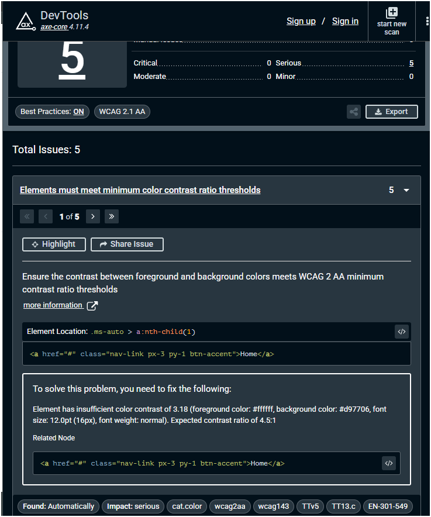
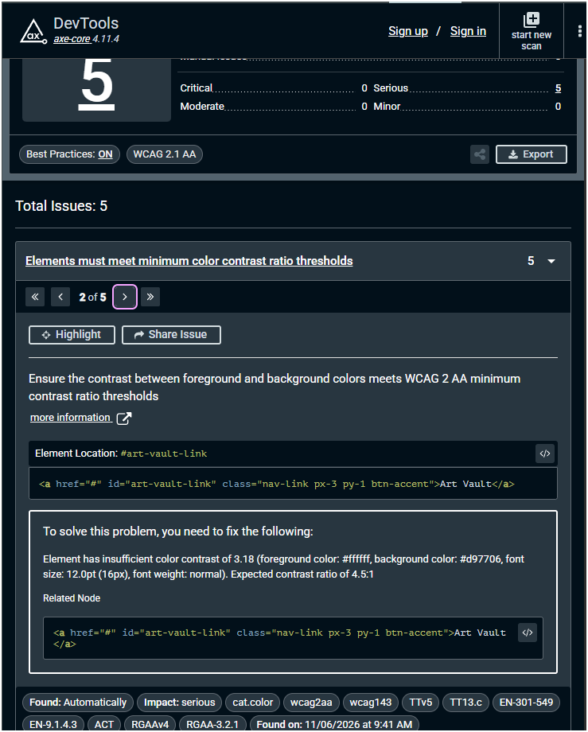
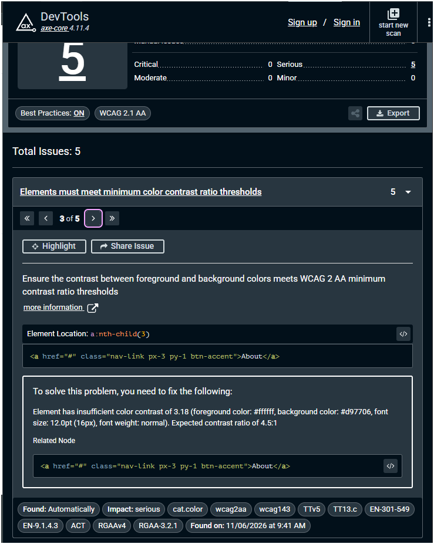
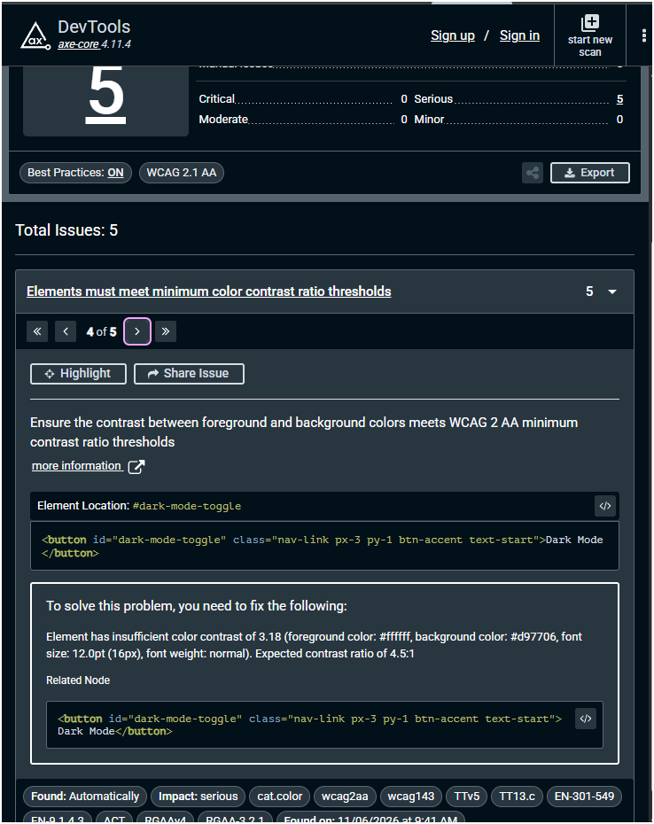
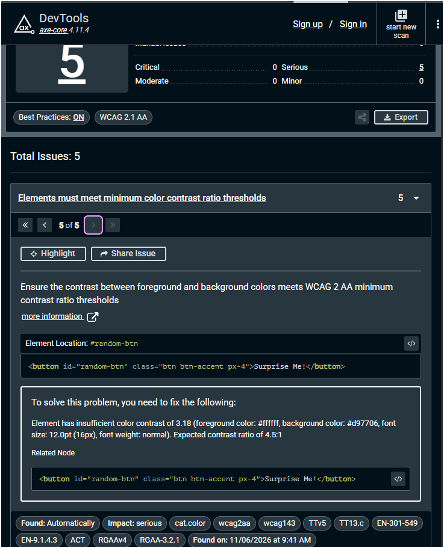
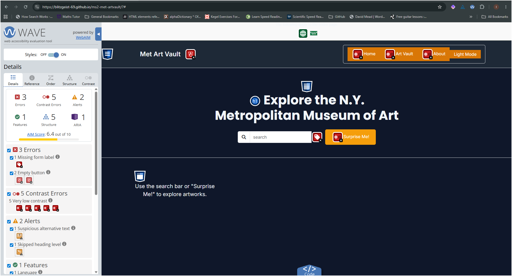

# Met Art Vault Testing Documentation

**Testing Strategy**
The testing strategy for Met Art Vault is **user-story driven** and follows a **mobile-first** approach.

**Core principles:**

- Every feature is tested against its Acceptance Criteria before being marked complete.
- Testing is performed on real devices and browser DevTools to simulate real users.
- Accessibility and performance are treated as equally important as visual design.
- All testing is documented with evidence.
- Bugs are logged immediately and re-tested after fixes.

**Testing types used:**

- Manual functional testing
- Responsiveness testing
- Accessibility & SEO checks
- HTML/CSS/JavaScript validation
- Cross-browser compatibility
- User-story validation

## Testing Plan

**Phase 1 – Unit/Feature Testing** (during development)  
Test each component (navbar, hero, cards, form, modals) as it is built.

**Phase 2 – User Story Validation**  
Go through every completed Must-Have, Should-Have and Could-Have user story.

**Phase 3 – Full Site Validation** on deployed site.

- Run all validators and Lighthouse
- Test on real devices
- Document bugs and fixes

**Tools used:**

- Chrome DevTools inc Lighthouse
- ESLint
- JSHint
- Firefox
- Microsoft Edge
- W3C HTML & CSS Validators
- Real devices: Windows 11 Desktop, Samsung Galaxy A55 phone, Samsung S4 Galaxy Tab

**Test Environment:**

- Operating System: Windows 11, Android 10 / 16
- Browser versions: Chrome 142 / 145, Firefox 148, Edge 145,

## In Development Test Screenshots

### Functions

#### Dark Mode

#### fetchObjectById

#### searchArtworks

URL Test

Search with empty input

Example "Sunflowers" search

Search with 'spaces' included

#### createCard(artwork)

Test Code

Test Code Result

#### renderArtworks

#### saveCurrentArtworkToVault

Confirming artwork saved to localStorage

Saving current artwork

Artwork already saved

#### Search

No results

Successful Search

Something Went Wrong - No internet connection

#### Suprise Me!

Some returned object IDs do not exist

All returned object IDs exist

#### Art Vault

Empty Vault

View Art Vault contents

New favourite added

#### Reset page clicking Home or "Met Art Vault"

Before Reset with Home

After Reset with Home

Before Reset with Logo

After Reset with Logo

### Post Development Testing

CSS updated with Autoprefixer

W3C CSS Validation Service - No Errors

W3C Markup Validation Service - Errors Identified

Axe DevTools

Issue 1

Issue 2

Issue 3

Issue 4

Issue 5

Wave Accessibility Evaluation Tool

Lighthouse

**Mobile Performance**

**Mobile Accessibility**

**Mobile Best Practices**

**Mobile SEO**

**Desktop Performance**

**Desktop Accessibility**

**Desktop Best Practices**

**Desktop SEO**

## Known Issues

### Contrast Ratio

Insufficient contrast ratio identified by Axe DevTools

### About button

This feature has currently not been implemented due to time contraints.

### HTML

1. Element  is missing attributes

2. Heading <h5> skips levels

### Mobile view

Navbar buttons differ in length on mobile

## Future Improvements

- Implement About feature
- Implemt Remove Artworks form Vault
- Implement Full Screen view of artworks
- Implement Show number of artworks saved
- Implement Department filter
- Bug fixes
- Improve accessibility